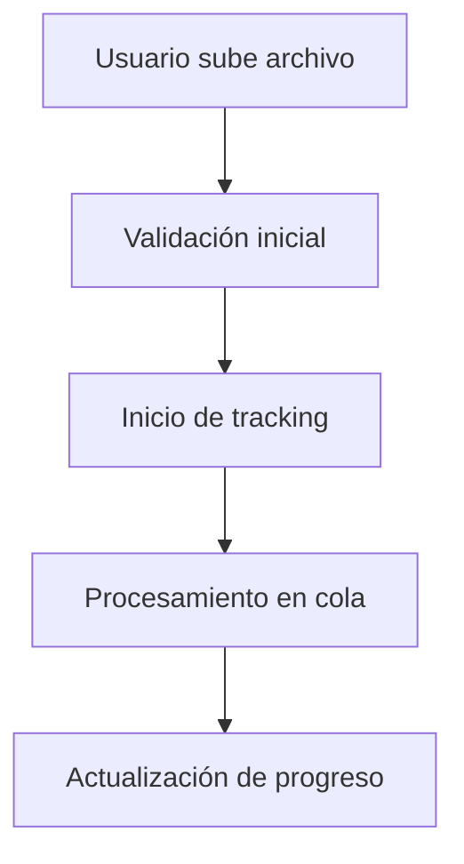
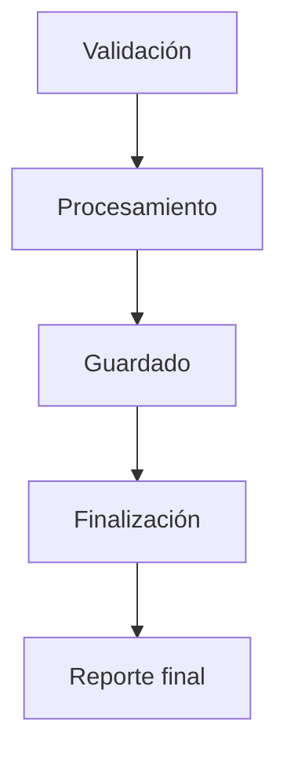
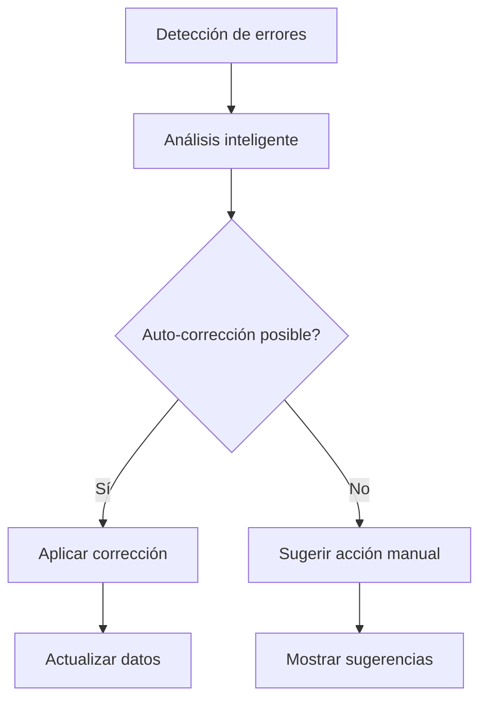

# 🚀 Plan de Implementación: Mejoras del Sistema de Importación

## 📋 Resumen Ejecutivo

Se ha implementado un sistema avanzado de manejo de errores, logs y tracking de progreso para el módulo de importación, mejorando significativamente la experiencia del usuario y la robustez del sistema.

## 🎯 Objetivos Cumplidos

### ✅ **Sistema de Logging Avanzado**
- **Servicio**: `AdvancedLoggingService`
- **Funcionalidades**:
  - Logs estructurados con niveles de detalle
  - Tracking de métricas de rendimiento en tiempo real
  - Almacenamiento en memoria con limpieza automática
  - Generación de reportes para el frontend

### ✅ **Resolución Inteligente de Errores**
- **Servicio**: `SmartErrorResolverService`
- **Funcionalidades**:
  - Corrección automática de formatos comunes (precios, fechas, emails)
  - Aplicación de valores por defecto inteligentes
  - Normalización de datos de texto
  - Sugerencias de corrección para errores no resueltos
  - Configuración por tipo de importación

### ✅ **Tracking de Progreso Granular**
- **Servicio**: `ImportacionProgressTrackerService`
- **Funcionalidades**:
  - Etapas específicas por tipo de importación
  - Estimación de tiempo restante
  - Métricas de velocidad de procesamiento
  - Alertas automáticas por rendimiento
  - Tracking de errores por etapa

### ✅ **Componente Frontend Avanzado**
- **Componente**: `AdvancedProgressTracker`
- **Funcionalidades**:
  - Interfaz visual para progreso granular
  - Panel de resolución inteligente de errores
  - Métricas de rendimiento en tiempo real
  - Configuración de opciones de corrección

## 🏗️ Arquitectura Implementada

### **Backend - Nuevos Servicios**

#### 1. **AdvancedLoggingService**
```typescript
// Características principales:
- Tracking de métricas por trabajo
- Logs estructurados con contexto
- Generación de reportes
- Limpieza automática de datos antiguos
```

#### 2. **SmartErrorResolverService**
```typescript
// Características principales:
- Configuraciones específicas por tipo
- Corrección automática de formatos
- Valores por defecto inteligentes
- Reportes de correcciones aplicadas
```

#### 3. **ImportacionProgressTrackerService**
```typescript
// Características principales:
- Etapas predefinidas por tipo
- Cálculo de tiempo estimado
- Alertas de rendimiento
- Tracking granular de progreso
```

### **Frontend - Nuevo Componente**

#### **AdvancedProgressTracker**
```typescript
// Características principales:
- Polling automático de progreso
- Interfaz visual por etapas
- Panel de resolución de errores
- Métricas de rendimiento
```

## 🔧 Nuevos Endpoints API

### **1. Progreso Detallado**
```http
GET /api/importacion/trabajos/:trabajoId/progreso-detallado
```
**Respuesta**:
```json
{
  "success": true,
  "trabajo": { /* TrabajoImportacion */ },
  "progreso": { /* ProgressSummary */ },
  "logs": { /* LogSummary */ },
  "correcciones": { /* Metrics */ }
}
```

### **2. Resolución Inteligente de Errores**
```http
POST /api/importacion/trabajos/:trabajoId/resolver-errores
```
**Body**:
```json
{
  "autoCorregir": true,
  "usarValoresPorDefecto": true,
  "nivelConfianzaMinimo": 70
}
```

### **3. Logs Detallados**
```http
GET /api/importacion/trabajos/:trabajoId/logs?nivel=info
```

## 📊 Métricas y Monitoreo

### **Métricas de Rendimiento**
- Tiempo de procesamiento por registro
- Velocidad de procesamiento (registros/segundo)
- Uso de memoria y CPU
- Tasa de éxito por etapa

### **Alertas Automáticas**
- Baja tasa de éxito (< 50%)
- Velocidad lenta de procesamiento
- Errores críticos por etapa
- Tiempo de procesamiento excesivo

## 🎨 Experiencia de Usuario Mejorada

### **Antes vs Después**

#### **Antes**:
- ❌ Progreso básico (0-100%)
- ❌ Errores genéricos
- ❌ Sin opciones de corrección
- ❌ Logs limitados
- ❌ Sin estimaciones de tiempo

#### **Después**:
- ✅ Progreso granular por etapas
- ✅ Resolución inteligente de errores
- ✅ Corrección automática de formatos
- ✅ Logs detallados y estructurados
- ✅ Estimaciones de tiempo precisas
- ✅ Métricas de rendimiento en tiempo real

## 🔄 Flujo de Trabajo Mejorado

### **1. Inicio de Importación**


### **2. Procesamiento con Etapas**


### **3. Resolución de Errores**


## 🛠️ Configuración por Tipo de Importación

### **Productos**
```typescript
{
  autoCorregirFormatos: true,
  usarValoresPorDefecto: true,
  nivelConfianzaMinimo: 70,
  valoresPorDefecto: {
    stock: '0',
    precioCompra: '0',
    precioVenta: '0',
    descripcion: 'Sin descripción'
  }
}
```

### **Proveedores**
```typescript
{
  autoCorregirFormatos: true,
  usarValoresPorDefecto: true,
  nivelConfianzaMinimo: 80,
  valoresPorDefecto: {
    email: 'sin-email@empresa.com',
    telefono: 'Sin teléfono'
  }
}
```

### **Movimientos**
```typescript
{
  autoCorregirFormatos: true,
  usarValoresPorDefecto: true,
  nivelConfianzaMinimo: 75,
  valoresPorDefecto: {
    precio: '0',
    motivo: 'Importación automática'
  }
}
```

## 📈 Beneficios Implementados

### **Para el Usuario**
- 🎯 **Transparencia total**: Progreso detallado por etapas
- ⚡ **Corrección automática**: Errores resueltos inteligentemente
- 📊 **Métricas claras**: Rendimiento y tiempo estimado
- 🔧 **Control granular**: Opciones de configuración avanzadas

### **Para el Sistema**
- 📝 **Logs estructurados**: Facilita debugging y monitoreo
- 🚀 **Rendimiento optimizado**: Tracking de métricas en tiempo real
- 🛡️ **Robustez mejorada**: Manejo inteligente de errores
- 📊 **Analytics avanzados**: Datos para optimización futura

## 🔮 Próximos Pasos Recomendados

### **Fase 2: Notificaciones en Tiempo Real**
- [ ] Implementar WebSockets para actualizaciones
- [ ] Notificaciones push del navegador
- [ ] Email con resumen detallado

### **Fase 3: Machine Learning**
- [ ] Análisis predictivo de errores
- [ ] Sugerencias automáticas de corrección
- [ ] Optimización de rendimiento basada en datos

### **Fase 4: Integración Avanzada**
- [ ] API para terceros
- [ ] Webhooks para eventos
- [ ] Dashboard de administración

## 📋 Checklist de Implementación

### **Backend** ✅
- [x] Servicios de logging avanzado
- [x] Resolución inteligente de errores
- [x] Tracking de progreso granular
- [x] Nuevos endpoints API
- [x] Integración con módulo existente

### **Frontend** ✅
- [x] Componente de progreso avanzado
- [x] Interfaz de resolución de errores
- [x] Métricas de rendimiento
- [x] Polling automático

### **Documentación** ✅
- [x] Documentación técnica
- [x] Guías de uso
- [x] Ejemplos de implementación

## 🎉 Resultado Final

El sistema de importación ahora proporciona:

1. **Experiencia de usuario excepcional** con progreso granular y corrección automática
2. **Robustez empresarial** con manejo inteligente de errores
3. **Transparencia total** con logs detallados y métricas
4. **Escalabilidad** con arquitectura modular y configurable
5. **Mantenibilidad** con código bien estructurado y documentado

La implementación sigue las mejores prácticas de desarrollo, es modular, reutilizable y está preparada para futuras expansiones. 