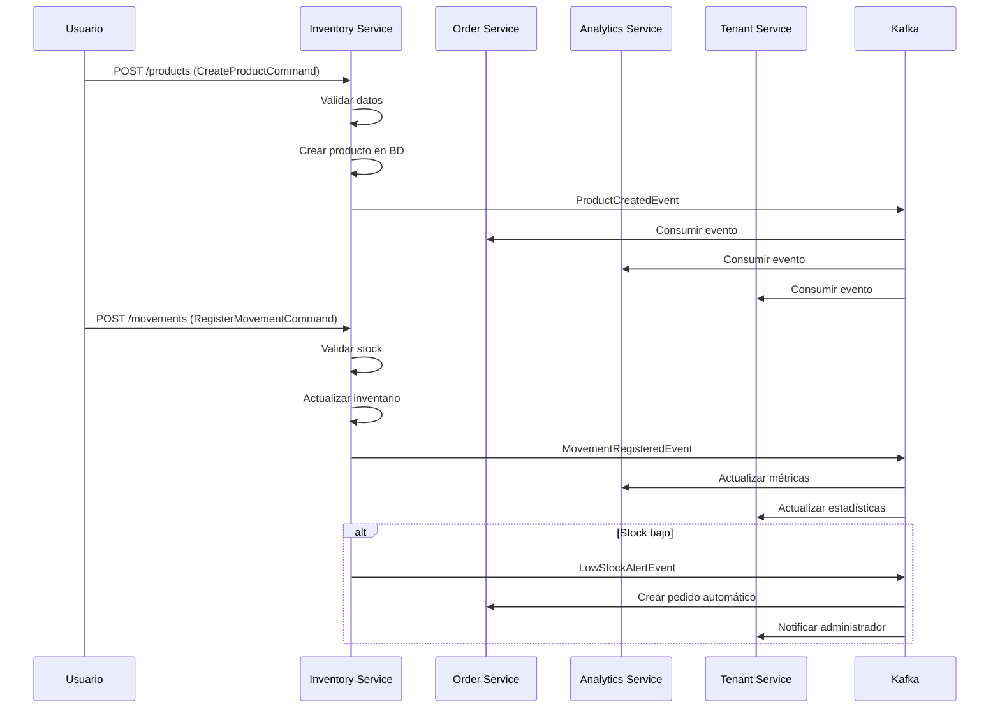
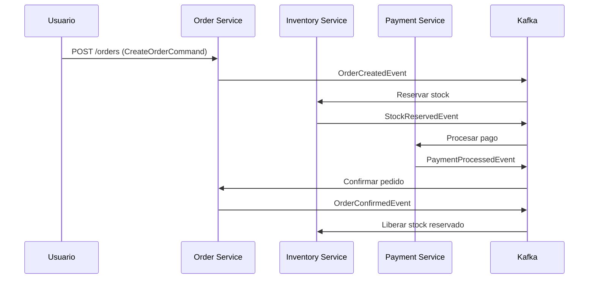

# 🏗️ Arquitectura de Microservicios con CQRS y DDD

## 📋 Resumen Ejecutivo

Esta propuesta evoluciona el sistema actual de monolitos hacia una arquitectura de microservicios que combina **CQRS (Command Query Responsibility Segregation)**, **DDD (Domain-Driven Design)** y **Event Sourcing** para crear un ERP SaaS escalable y mantenible.

## 🎯 Objetivos de la Arquitectura

### ✅ **Beneficios Esperados:**
- **Escalabilidad horizontal** por contexto de negocio
- **Alta disponibilidad** con fallos aislados
- **Desarrollo independiente** de equipos
- **Optimización específica** por dominio
- **Trazabilidad completa** con eventos
- **Flexibilidad tecnológica** por microservicio

### 🔄 **Flujo de Eventos Propuesto:**

```
1. Usuario crea producto → Inventory Service
2. Inventory Service publica "ProductCreatedEvent"
3. Order Service consume evento → Actualiza catálogo
4. Analytics Service consume evento → Actualiza métricas
5. Tenant Service consume evento → Actualiza estadísticas
```

## 🏢 **Contextos Delimitados (DDD)**

### 1. **Tenant Management** 🏢
**Responsabilidades:**
- Gestión de inquilinos/empresas
- Autenticación y autorización
- Gestión de usuarios y roles
- Configuración multi-tenant

**Tecnologías:**
- Base de datos: PostgreSQL (multi-tenant)
- Cache: Redis para sesiones
- Eventos: Kafka para eventos de dominio

### 2. **Inventory Management** 📦
**Responsabilidades:**
- Gestión de productos
- Control de inventario
- Movimientos de stock
- Predicciones y alertas

**Tecnologías:**
- Base de datos: PostgreSQL (especializada)
- Cache: Redis para consultas frecuentes
- Eventos: Kafka + Event Sourcing
- CQRS: Separación de comandos y consultas

### 3. **Order Management** 🛒
**Responsabilidades:**
- Gestión de pedidos
- Gestión de proveedores
- Flujo de compras
- Aprobaciones y autorizaciones

**Tecnologías:**
- Base de datos: PostgreSQL
- Eventos: Kafka para flujo de pedidos
- Saga Pattern: Para transacciones distribuidas

### 4. **Analytics & Reporting** 📊
**Responsabilidades:**
- KPIs y métricas
- Reportes en tiempo real
- Datos de sensores
- Análisis predictivo

**Tecnologías:**
- Base de datos: ClickHouse (OLAP)
- Cache: Redis para métricas
- Eventos: Kafka para streaming
- ML: TensorFlow para predicciones

### 5. **System Administration** ⚙️
**Responsabilidades:**
- Administración del sistema
- Auditoría y logs
- Configuración global
- Monitoreo y salud

**Tecnologías:**
- Base de datos: PostgreSQL
- Logs: ELK Stack
- Monitoreo: Prometheus + Grafana

## 🔄 **Flujo Detallado de Eventos**

### **Escenario: Crear Producto y Registrar Movimiento**



### **Escenario: Procesamiento de Pedidos**



## 🏗️ **Implementación Técnica**

### **1. Comunicación Entre Microservicios**

#### **Síncrona (HTTP/REST):**
```typescript
// Para operaciones que requieren respuesta inmediata
@Injectable()
export class InventoryClient {
  async checkStockAvailability(productId: number): Promise<boolean> {
    return this.httpService.get(`/inventory/products/${productId}/availability`);
  }
}
```

#### **Asíncrona (Kafka):**
```typescript
// Para eventos de dominio
@Injectable()
export class InventoryEventBus {
  async publishProductCreated(event: ProductCreatedEvent): Promise<void> {
    await this.kafkaProducer.send({
      topic: 'inventory.product.created',
      messages: [{ value: JSON.stringify(event) }],
    });
  }
}
```

### **2. CQRS Implementation**

#### **Commands (Escritura):**
```typescript
export class CreateProductCommand {
  nombre: string;
  precio: number;
  empresaId: number;
  createdBy: number;
}

@Injectable()
export class CreateProductHandler {
  async execute(command: CreateProductCommand) {
    // 1. Validar
    // 2. Crear en BD
    // 3. Publicar evento
    // 4. Actualizar proyecciones
  }
}
```

#### **Queries (Lectura):**
```typescript
export class GetProductsQuery {
  empresaId: number;
  filters?: any;
}

@Injectable()
export class GetProductsHandler {
  async execute(query: GetProductsQuery) {
    // Consultar proyección optimizada
    return this.productProjection.findByTenant(query.empresaId);
  }
}
```

### **3. Event Sourcing**

#### **Event Store:**
```typescript
export interface EventStore {
  append(streamId: string, events: DomainEvent[]): Promise<void>;
  getEvents(streamId: string): Promise<DomainEvent[]>;
  getEventsByType(eventType: string): Promise<DomainEvent[]>;
}
```

#### **Aggregate:**
```typescript
export class ProductAggregate {
  private events: DomainEvent[] = [];
  
  createProduct(command: CreateProductCommand): void {
    const event = new ProductCreatedEvent(command);
    this.apply(event);
    this.events.push(event);
  }
  
  private apply(event: DomainEvent): void {
    // Aplicar evento al estado del agregado
  }
}
```

## 📊 **Patrones de Diseño Aplicados**

### **1. Saga Pattern**
Para transacciones distribuidas (ej: crear pedido → reservar stock → procesar pago)

### **2. CQRS**
Separación de comandos (escritura) y consultas (lectura) para optimización

### **3. Event Sourcing**
Historial completo de cambios como secuencia de eventos

### **4. Circuit Breaker**
Para manejar fallos en comunicación entre servicios

### **5. Bulkhead Pattern**
Aislamiento de recursos por microservicio

## 🔧 **Configuración de Infraestructura**

### **Docker Compose para Desarrollo:**
```yaml
version: '3.8'
services:
  # Base de datos
  postgres:
    image: postgres:15
    environment:
      POSTGRES_DB: iam_erp
      POSTGRES_USER: postgres
      POSTGRES_PASSWORD: password
    
  # Message Broker
  kafka:
    image: confluentinc/cp-kafka:latest
    depends_on:
      - zookeeper
    
  # Cache
  redis:
    image: redis:7-alpine
    
  # Microservicios
  tenant-service:
    build: ./microservices/tenant-management
    ports:
      - "3001:3000"
    
  inventory-service:
    build: ./microservices/inventory-management
    ports:
      - "3002:3000"
    
  order-service:
    build: ./microservices/order-management
    ports:
      - "3003:3000"
```

### **Kubernetes para Producción:**
```yaml
apiVersion: apps/v1
kind: Deployment
metadata:
  name: inventory-service
spec:
  replicas: 3
  selector:
    matchLabels:
      app: inventory-service
  template:
    metadata:
      labels:
        app: inventory-service
    spec:
      containers:
      - name: inventory-service
        image: iam-erp/inventory-service:latest
        ports:
        - containerPort: 3000
        env:
        - name: DATABASE_URL
          valueFrom:
            secretKeyRef:
              name: db-secret
              key: url
```

## 📈 **Métricas y Monitoreo**

### **Health Checks:**
```typescript
@Controller('health')
export class HealthController {
  @Get()
  async getHealth() {
    return {
      status: 'ok',
      timestamp: new Date(),
      services: {
        database: await this.checkDatabase(),
        kafka: await this.checkKafka(),
        redis: await this.checkRedis(),
      },
    };
  }
}
```

### **Métricas de Negocio:**
- Productos creados por día
- Movimientos de inventario por hora
- Tiempo de respuesta de consultas
- Tasa de éxito de transacciones

## 🚀 **Plan de Migración**

### **Fase 1: Preparación (2-3 semanas)**
1. Configurar infraestructura (Kafka, Redis, bases de datos)
2. Implementar patrones base (CQRS, Event Bus)
3. Crear microservicios de prueba

### **Fase 2: Migración Gradual (4-6 semanas)**
1. Migrar Tenant Management
2. Migrar Inventory Management
3. Migrar Order Management
4. Migrar Analytics

### **Fase 3: Optimización (2-3 semanas)**
1. Implementar Event Sourcing
2. Optimizar consultas con CQRS
3. Configurar monitoreo avanzado

### **Fase 4: Producción (1-2 semanas)**
1. Testing exhaustivo
2. Despliegue gradual
3. Monitoreo y ajustes

## 💡 **Consideraciones de Implementación**

### **Ventajas:**
- ✅ Escalabilidad horizontal
- ✅ Mantenibilidad mejorada
- ✅ Despliegues independientes
- ✅ Tecnologías específicas por dominio
- ✅ Tolerancia a fallos

### **Desafíos:**
- ⚠️ Complejidad de comunicación
- ⚠️ Consistencia eventual
- ⚠️ Overhead de infraestructura
- ⚠️ Curva de aprendizaje del equipo

### **Recomendaciones:**
1. **Empezar pequeño:** Migrar un contexto a la vez
2. **Mantener compatibilidad:** API Gateway para transición
3. **Monitoreo exhaustivo:** Métricas desde el día 1
4. **Documentación:** Mantener documentación actualizada
5. **Testing:** Pruebas de integración entre servicios

## 🎯 **Próximos Pasos**

1. **Validar arquitectura** con el equipo técnico
2. **Definir prioridades** de migración
3. **Configurar entorno** de desarrollo
4. **Implementar POC** con un microservicio
5. **Planificar migración** detallada

---

*Esta arquitectura proporciona una base sólida para escalar el ERP SaaS a miles de inquilinos mientras mantiene la flexibilidad para evolucionar cada dominio de negocio de manera independiente.* 