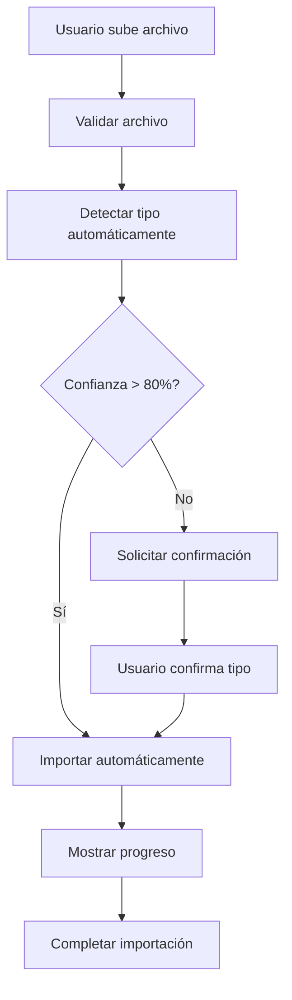
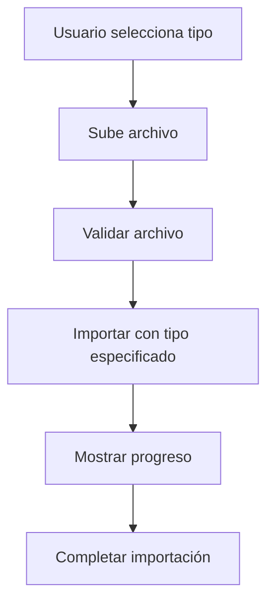
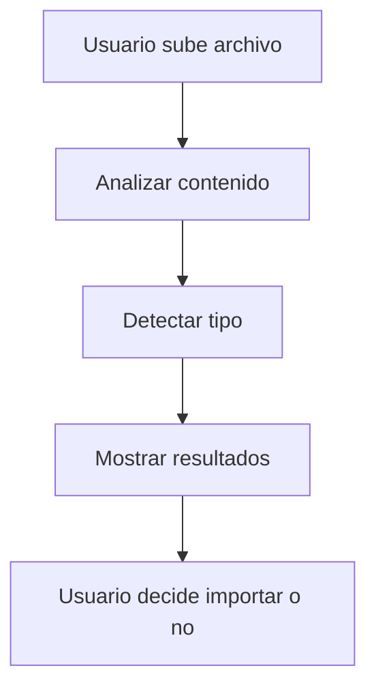

# Nuevos Endpoints de Importación - Implementación Completa

## Resumen de Endpoints Implementados

Se han implementado los siguientes endpoints del backend en el frontend:

### ✅ **Endpoints Principales:**

1. **`POST /importacion/unificada`** - Importación con tipo especificado
2. **`POST /importacion/auto`** - Importación automática (RECOMENDADO)
3. **`POST /importacion/auto/validar`** - Validar archivo antes de importar
4. **`POST /importacion/auto/confirmar`** - Confirmar tipo cuando detección no es segura
5. **`GET /importacion/tipos-soportados`** - Información de tipos soportados
6. **`GET /importacion/plantillas-mejoradas/:tipo`** - Plantillas optimizadas

## Arquitectura Implementada

### 1. **API Layer (`iam-frontend/src/lib/api/importacion.ts`)**

#### Nuevas Interfaces:
```typescript
// Importación unificada
export interface ImportacionUnificadaDto {
  tipo: 'productos' | 'proveedores' | 'movimientos'
  sobrescribirExistentes: boolean
  validarSolo: boolean
  notificarEmail: boolean
  emailNotificacion?: string
  configuracionEspecifica?: any
}

// Importación automática
export interface ImportacionAutoDto {
  sobrescribirExistentes: boolean
  validarSolo: boolean
  notificarEmail: boolean
  emailNotificacion?: string
  configuracionEspecifica?: any
}

// Detección de tipo
export interface DeteccionTipoResponse {
  success: boolean
  tipoDetectado?: 'productos' | 'proveedores' | 'movimientos'
  confianza: number // 0-100
  razones: string[]
  necesitaConfirmacion: boolean
  sugerencias?: string[]
}

// Tipos soportados
export interface TipoSoportado {
  tipo: 'productos' | 'proveedores' | 'movimientos'
  nombre: string
  descripcion: string
  camposRequeridos: string[]
  camposOpcionales: string[]
  formatosSoportados: string[]
  maxFileSizeMB: number
  icono: string
  color: string
}
```

#### Nuevos Métodos de API:
```typescript
// Importación unificada
async importarUnificada(archivo: File, opciones: ImportacionUnificadaDto): Promise<ResultadoImportacion>

// Importación automática
async importarAuto(archivo: File, opciones: ImportacionAutoDto): Promise<ResultadoImportacion>

// Validación automática
async validarAuto(archivo: File, opciones?: ValidacionAutoDto): Promise<DeteccionTipoResponse>

// Confirmación automática
async confirmarAuto(trabajoId: string, opciones: ConfirmacionAutoDto): Promise<ResultadoImportacion>

// Obtener tipos soportados
async obtenerTiposSoportados(): Promise<TiposSoportadosResponse>

// Descargar plantilla mejorada
async descargarPlantillaMejorada(tipo: TipoImportacion): Promise<Blob>
```

### 2. **Hook Layer (`iam-frontend/src/hooks/useImportacion.ts`)**

#### Nuevas Funciones:
```typescript
// Importación unificada usando nuevo endpoint
const importarUnificada = useCallback(async (archivo: File, opciones: ImportacionUnificadaDto) => {
  // Implementación completa
}, [handleImportResponse, handleError])

// Importación automática
const importarAuto = useCallback(async (archivo: File, opciones: ImportacionAutoDto) => {
  // Implementación completa
}, [handleImportResponse, handleError])

// Validación automática
const validarAuto = useCallback(async (archivo: File, opciones?: any) => {
  // Implementación completa
}, [handleError])

// Confirmación automática
const confirmarAuto = useCallback(async (trabajoId: string, opciones: any) => {
  // Implementación completa
}, [handleImportResponse, handleError])

// Cargar tipos soportados
const loadTiposSoportados = useCallback(async () => {
  // Implementación completa
}, [handleError])

// Descargar plantilla mejorada
const descargarPlantillaMejorada = useCallback(async (tipo: TipoImportacion) => {
  // Implementación completa
}, [handleError])
```

#### Nuevo Estado:
```typescript
interface ImportacionState {
  // ... estado existente
  tiposSoportados: TipoSoportado[]
  deteccionTipo: DeteccionTipoResponse | null
  isLoadingTipos: boolean
}
```

### 3. **Component Layer**

#### A. **AutoImportModal.tsx** - Modal de Importación Inteligente
- **Funcionalidad**: Detecta automáticamente el tipo de archivo
- **Características**:
  - Drag & drop de archivos
  - Análisis automático del contenido
  - Detección de tipo con nivel de confianza
  - Confirmación manual cuando es necesario
  - Sugerencias de mejora
  - Descarga de plantillas mejoradas

#### B. **ImportButton.tsx** - Botón Unificado Mejorado
- **Funcionalidad**: Selector de modo de importación
- **Modos disponibles**:
  - **Importación Inteligente**: Detección automática
  - **Importación Manual**: Selección manual del tipo
- **Variantes**:
  - `DashboardImportButton`: Para el dashboard principal
  - `CompactImportButton`: Versión compacta
  - `AutoImportButton`: Solo importación automática

#### C. **TestImportModal.tsx** - Componente de Pruebas
- **Funcionalidad**: Prueba todos los nuevos endpoints
- **Modos de prueba**:
  - Importación Automática (RECOMENDADO)
  - Importación Unificada
  - Solo Validación

## Flujo de Usuario

### 1. **Importación Automática (Recomendado)**



### 2. **Importación Unificada**



### 3. **Validación Previa**



## Características Implementadas

### ✅ **Detección Automática**
- Análisis del contenido del archivo
- Detección de columnas y patrones
- Nivel de confianza (0-100%)
- Razones de detección
- Sugerencias de mejora

### ✅ **Confirmación Inteligente**
- Solicita confirmación cuando confianza < 80%
- Muestra razones de la detección
- Permite corrección manual del tipo

### ✅ **Plantillas Mejoradas**
- Plantillas optimizadas por tipo
- Campos requeridos y opcionales
- Ejemplos de datos
- Validaciones integradas

### ✅ **Interfaz Unificada**
- Un solo botón para todos los tipos
- Selector de modo intuitivo
- Diseño consistente con el sistema
- Feedback visual en tiempo real

### ✅ **Manejo de Errores**
- Validación de archivos
- Mensajes de error descriptivos
- Recuperación de errores
- Logs detallados para debugging

## Uso de los Nuevos Endpoints

### 1. **Importación Automática (Recomendado)**
```typescript
const { importarAuto } = useImportacion()

await importarAuto(archivo, {
  sobrescribirExistentes: false,
  validarSolo: false,
  notificarEmail: true,
  emailNotificacion: 'usuario@ejemplo.com'
})
```

### 2. **Validación Previa**
```typescript
const { validarAuto } = useImportacion()

const resultado = await validarAuto(archivo)
console.log('Tipo detectado:', resultado.tipoDetectado)
console.log('Confianza:', resultado.confianza)
```

### 3. **Importación Unificada**
```typescript
const { importarUnificada } = useImportacion()

await importarUnificada(archivo, {
  tipo: 'productos',
  sobrescribirExistentes: false,
  validarSolo: false,
  notificarEmail: true
})
```

### 4. **Confirmación de Tipo**
```typescript
const { confirmarAuto } = useImportacion()

await confirmarAuto(trabajoId, {
  tipoConfirmado: 'productos',
  sobrescribirExistentes: false,
  validarSolo: false
})
```

## Ventajas de la Nueva Implementación

### 🚀 **Experiencia de Usuario Mejorada**
- Un solo botón para todos los tipos
- Detección automática reduce errores
- Interfaz más intuitiva y moderna

### 🧠 **Inteligencia Artificial**
- Análisis automático del contenido
- Detección de patrones y columnas
- Sugerencias de mejora

### ⚡ **Rendimiento Optimizado**
- Endpoints unificados reducen llamadas
- Validación previa evita errores
- Procesamiento en segundo plano

### 🔧 **Mantenibilidad**
- Código modular y reutilizable
- Separación clara de responsabilidades
- Fácil extensión para nuevos tipos

### 🛡️ **Robustez**
- Manejo completo de errores
- Validación en múltiples niveles
- Recuperación automática

## Próximos Pasos

1. **Probar la funcionalidad** con archivos reales
2. **Optimizar la detección** basada en feedback
3. **Agregar más tipos** de importación si es necesario
4. **Implementar cache** para tipos soportados
5. **Agregar métricas** de uso y rendimiento

## Comandos para Probar

```bash
# Iniciar el frontend
cd iam-frontend && npm run dev

# Ver logs en tiempo real
cd iam-frontend && npm run dev 2>&1 | tee frontend.log

# Verificar dependencias
cd iam-frontend && npm list react
```

## Contacto

Para reportar problemas o solicitar mejoras:
1. Revisar la consola del navegador
2. Verificar los logs del servidor
3. Comprobar la conectividad con el backend 