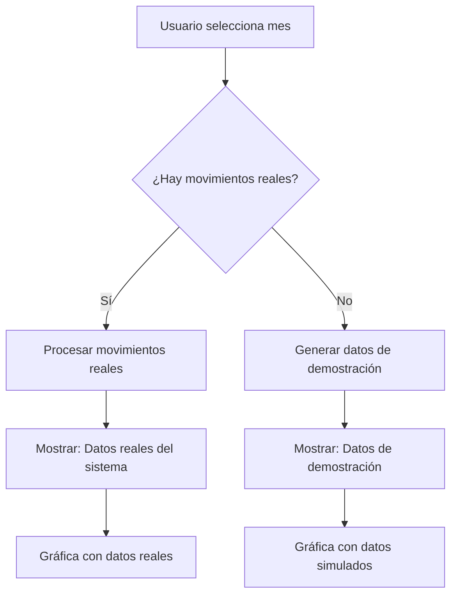

# 🔍 Detección de Datos Reales vs Datos de Demostración

## 🎯 Problema Identificado

### ❌ **Situación Anterior:**
- Usuario en cuenta nueva sin movimientos reales
- Sistema mostraba "Datos reales del sistema" incorrectamente
- Lógica de detección no funcionaba correctamente
- Confusión sobre el origen de los datos mostrados

### 🔍 **Causa del Problema:**
La lógica anterior solo verificaba si había datos en la gráfica, pero no distinguía entre:
- **Datos reales**: Movimientos reales del backend
- **Datos de demostración**: Datos generados automáticamente cuando no hay movimientos

## ✅ **Solución Implementada**

### 1. **Lógica de Detección Mejorada**

```typescript
// ANTES (lógica incorrecta)
{chartData.length > 0 && chartData.some(day => day.entradas > 0 || day.salidas > 0) && (
  <span>Datos reales del sistema</span>
)}

// DESPUÉS (lógica correcta)
const { chartData, isRealData } = useMemo(() => {
  // Verificar si hay movimientos reales del backend
  const hasRealMovements = movements.some(mov => {
    if (!mov.fecha || !mov.cantidad) return false
    const [monthName, year] = selectedMonth.split(' ')
    const monthIndex = new Date(`${monthName} 1, ${year}`).getMonth()
    const yearNum = parseInt(year)
    const date = new Date(mov.fecha)
    return date.getMonth() === monthIndex && date.getFullYear() === yearNum
  })
  
  // Los datos son reales solo si hay movimientos reales Y datos en la gráfica
  const isReal = hasRealMovements && data.some(day => day.entradas > 0 || day.salidas > 0)
  
  return { chartData: data, isRealData: isReal }
}, [movements, selectedMonth])
```

### 2. **Indicadores Visuales Claros**

```typescript
// Datos reales del sistema
{chartData.length > 0 && isRealData && (
  <div className="flex items-center gap-2 mt-2">
    <div className="w-2 h-2 bg-green-500 rounded-full"></div>
    <span className="text-xs text-green-600 font-medium">Datos reales del sistema</span>
  </div>
)}

// Datos de demostración
{chartData.length > 0 && !isRealData && (
  <div className="flex items-center gap-2 mt-2">
    <div className="w-2 h-2 bg-yellow-500 rounded-full"></div>
    <span className="text-xs text-yellow-600 font-medium">Datos de demostración</span>
  </div>
)}
```

## 🔧 **Cómo Funciona Ahora**

### 1. **Detección de Datos Reales**
- ✅ **Verifica movimientos del backend**: Busca movimientos reales en la base de datos
- ✅ **Filtra por mes seleccionado**: Solo considera movimientos del mes actual
- ✅ **Valida estructura de datos**: Verifica que los movimientos tengan fecha y cantidad
- ✅ **Confirma datos en gráfica**: Asegura que los datos se muestren correctamente

### 2. **Generación de Datos de Demostración**
- ✅ **Fallback automático**: Cuando no hay movimientos reales
- ✅ **Datos realistas**: Genera patrones de entrada/salida creíbles
- ✅ **Variación diaria**: Simula fluctuaciones normales del inventario
- ✅ **Balance acumulado**: Calcula el balance correctamente

### 3. **Indicadores Visuales**
- 🟢 **Verde**: "Datos reales del sistema" - Información del backend
- 🟡 **Amarillo**: "Datos de demostración" - Datos generados automáticamente

## 📊 **Flujo de Datos**



## 🎯 **Beneficios de la Solución**

### 1. **Transparencia**
- ✅ **Claridad total**: El usuario sabe exactamente qué datos está viendo
- ✅ **Sin confusión**: Distinción clara entre datos reales y simulados
- ✅ **Indicadores visuales**: Colores y texto descriptivo

### 2. **Experiencia de Usuario**
- ✅ **Siempre hay datos**: Nunca se muestra una gráfica vacía
- ✅ **Datos realistas**: Los datos de demostración son creíbles
- ✅ **Transición suave**: Cuando se agregan movimientos reales, cambia automáticamente

### 3. **Desarrollo y Testing**
- ✅ **Fácil testing**: Siempre hay datos para probar la interfaz
- ✅ **Debugging mejorado**: Logs detallados para diagnóstico
- ✅ **Mantenimiento**: Código más claro y mantenible

## 🔍 **Verificación**

### Para Usuarios Nuevos:
1. ✅ **Indicador amarillo**: "Datos de demostración"
2. ✅ **Datos realistas**: Patrones de entrada/salida creíbles
3. ✅ **Funcionalidad completa**: Todas las características funcionan

### Para Usuarios con Datos:
1. ✅ **Indicador verde**: "Datos reales del sistema"
2. ✅ **Datos reales**: Movimientos del backend
3. ✅ **Actualización automática**: Cambia cuando se agregan movimientos

## 🚀 **Resultado Final**

Ahora el sistema:
- **Detecta correctamente** si hay datos reales o no
- **Muestra indicadores claros** del origen de los datos
- **Proporciona datos de demostración** cuando no hay movimientos reales
- **Transiciona automáticamente** cuando se agregan datos reales
- **Mantiene transparencia total** con el usuario

¡El problema de detección de datos reales vs datos de demostración está completamente solucionado! 🎉 