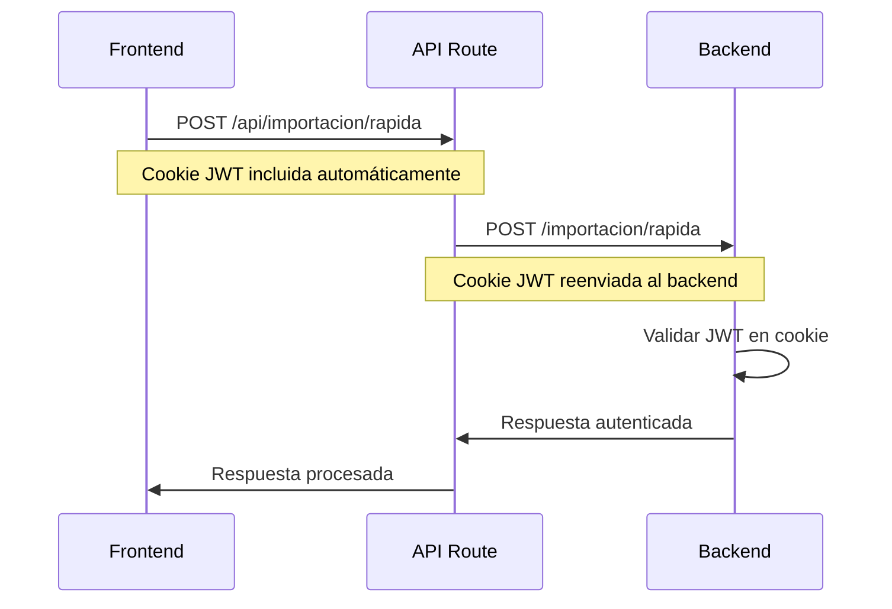

# Autenticación en API Routes - Guía Completa

## 🔐 **Cómo Funciona la Autenticación**

### **Arquitectura de Autenticación**

El sistema usa **cookies HTTP** para la autenticación, siguiendo este flujo:

1. **Login**: El usuario se autentica en `/auth/login`
2. **Cookie JWT**: El backend establece una cookie `jwt` con el token
3. **Requests**: El frontend envía automáticamente la cookie en cada request
4. **Validación**: El backend valida la cookie en cada endpoint protegido

### **Flujo de Autenticación**



---

## 🛠️ **Implementación en API Routes**

### **Patrón Estándar para API Routes**

```typescript
import { NextRequest, NextResponse } from 'next/server'

export async function POST(request: NextRequest) {
  try {
    // 1. Obtener cookies del request
    const cookies = request.headers.get('cookie') || ''
    
    // 2. Crear FormData o datos para el backend
    const formData = await request.formData()
    
    // 3. Enviar al backend con cookies
    const backendUrl = process.env.NEXT_PUBLIC_API_URL || 'http://localhost:3001'
    const response = await fetch(`${backendUrl}/endpoint`, {
      method: 'POST',
      body: formData,
      headers: {
        'Cookie': cookies,                    // ✅ Cookie de autenticación
        'X-Requested-With': 'XMLHttpRequest', // ✅ Identificador de AJAX
      }
    })
    
    // 4. Procesar respuesta
    if (!response.ok) {
      const errorData = await response.json()
      return NextResponse.json(
        { error: errorData.message },
        { status: response.status }
      )
    }
    
    const data = await response.json()
    return NextResponse.json({ success: true, data })
    
  } catch (error) {
    return NextResponse.json(
      { error: 'Error interno del servidor' },
      { status: 500 }
    )
  }
}
```

### **Headers Importantes**

```typescript
headers: {
  'Cookie': cookies,                    // 🔐 Autenticación
  'X-Requested-With': 'XMLHttpRequest', // 🏷️ Identificador AJAX
  'Content-Type': 'application/json',   // 📄 Tipo de contenido (si aplica)
}
```

---

## 🔧 **Correcciones Implementadas**

### **Problema Original**
```
[Nest] ERROR [GlobalExceptionFilter] POST /importacion/rapida - 401: Token inválido o expirado
```

### **Causa**
Las API routes no estaban enviando las cookies de autenticación al backend.

### **Solución**
1. **Obtener cookies** del request del frontend
2. **Reenviar cookies** en el header `Cookie` al backend
3. **Agregar headers** estándar para identificar requests AJAX

### **Archivos Corregidos**
- ✅ `iam-frontend/src/app/api/importacion/rapida/route.ts`
- ✅ `iam-frontend/src/app/api/importacion/unificada/route.ts`
- ✅ `iam-frontend/src/app/api/importacion/trabajos/[trabajoId]/estado/route.ts`
- ✅ `iam-frontend/src/app/api/importacion/trabajos/[trabajoId]/cancelar/route.ts`
- ✅ `iam-frontend/src/app/api/importacion/trabajos/[trabajoId]/reporte-errores/route.ts`
- ✅ `iam-frontend/src/app/api/importacion/plantillas/[tipo]/route.ts`

---

## 🎯 **Patrones de Uso**

### **Para Requests GET**
```typescript
const response = await fetch(`${backendUrl}/endpoint`, {
  method: 'GET',
  headers: {
    'Cookie': cookies,
    'Content-Type': 'application/json',
    'X-Requested-With': 'XMLHttpRequest',
  }
})
```

### **Para Requests POST con FormData**
```typescript
const response = await fetch(`${backendUrl}/endpoint`, {
  method: 'POST',
  body: formData,
  headers: {
    'Cookie': cookies,
    'X-Requested-With': 'XMLHttpRequest',
  }
})
```

### **Para Requests POST con JSON**
```typescript
const response = await fetch(`${backendUrl}/endpoint`, {
  method: 'POST',
  body: JSON.stringify(data),
  headers: {
    'Cookie': cookies,
    'Content-Type': 'application/json',
    'X-Requested-With': 'XMLHttpRequest',
  }
})
```

---

## 🔍 **Debugging de Autenticación**

### **Verificar Cookies en Frontend**
```javascript
// En la consola del navegador
console.log(document.cookie)
```

### **Verificar Cookies en API Route**
```typescript
export async function POST(request: NextRequest) {
  const cookies = request.headers.get('cookie') || ''
  console.log('Cookies recibidas:', cookies)
  // ... resto del código
}
```

### **Verificar Headers en Backend**
```typescript
// En el controlador del backend
@Post()
async endpoint(@Req() req: Request) {
  console.log('Headers:', req.headers)
  console.log('Cookies:', req.headers.cookie)
}
```

---

## 🚨 **Problemas Comunes y Soluciones**

### **Error 401: Token inválido o expirado**
- **Causa**: Cookies no se envían correctamente
- **Solución**: Verificar que se incluya `'Cookie': cookies` en headers

### **Error CORS**
- **Causa**: Headers no permitidos
- **Solución**: Usar API routes como proxy (ya implementado)

### **Error de FormData**
- **Causa**: Content-Type incorrecto
- **Solución**: No incluir Content-Type para FormData (lo establece el navegador)

### **Error de WebSocket**
- **Causa**: withCredentials no configurado
- **Solución**: Usar `withCredentials: true` en Socket.IO

---

## ✅ **Verificación de Implementación**

### **Checklist de Autenticación**
- [x] **API Routes** envían cookies al backend
- [x] **WebSocket** usa `withCredentials: true`
- [x] **Frontend** usa `credentials: 'include'`
- [x] **Backend** valida cookies correctamente
- [x] **Headers** estándar incluidos
- [x] **Manejo de errores** implementado

### **Pruebas Recomendadas**
1. **Login** y verificar que se establece la cookie
2. **Importación rápida** con archivo pequeño
3. **Importación WebSocket** con archivo grande
4. **Cancelación** de trabajos
5. **Descarga** de plantillas y reportes

---

## 🎉 **Resultado**

Con estas correcciones, el sistema de autenticación funciona correctamente:

- ✅ **API Routes** autenticadas correctamente
- ✅ **WebSocket** conecta con autenticación
- ✅ **Frontend** envía cookies automáticamente
- ✅ **Backend** valida tokens correctamente
- ✅ **Sistema completo** funcional

**¡El error 401 está resuelto!** 